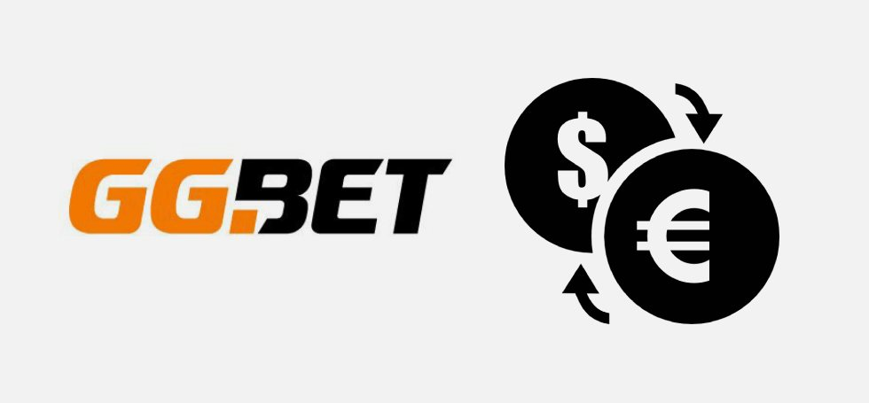

БК GGBet была создана в далеком 2016 году компанией Brivio Ltd. В России букмекерская контора GGBet работает по лицензии Федеральной налоговой службы №24, выданной на имя ООО "Бет. Ру". На площадке широкая линия ставок: беттерам предлагается заключать пари на матчи по футболу, хоккею, теннису, баскетболу.
  

Компания принимает ставки на киберспорт: CS Go, Call Of Duty, Фортнайт, Dota 2, King Of Glory.

Заходить на официальный сайт БК можно с смартфона, планшета, компьютера. Для портативных устройств была создана мобильная версия веб-страницы, открывающаяся во всех браузерах. 

<h2>Преимущества GGBet</h2>

Беттеры могут легально делать ставки на киберспорт в GGBet, оперативно обналичивать выигрыши. Букмекерская контора устанавливает высокие коэффициенты выплат, дарит посетителям бонусы. Другие важные плюсы портала: 
 <ul> <li>низкий размер минимальной ставки; </li> <li>регулярное проведение акций; </li> <li>отзывчивость саппорта; </li> <li>большой выбор актуальных киберспортивных дисциплин; </li> <li>быстрота и удобство проведения транзакций. </li> </ul>

К ключевым преимуществам БК относится прозрачность правил. На официальном сайте конторы собрана детальная информация о том, как делать ставки на спорт и киберспорт, выводить выигрыши и пополнять счет, использовать бонусы. За дополнительными консультациями посетителям портала предлагается обращаться в круглосуточную службу технической поддержки. С операторами можно связаться по телефону или с помощью электронной почты. Среднее время ожидания ответа специалистов - три-пять минут. 

Бонусы в букмекерской конторе выдаются при проведении акций. О появлении новых спецпредложений беттеры информируются по электронной почте. На email также могут приходить промокоды для активации дополнительных подарков. 
 
На сайте GGBet есть раздел "Казино", где можно играть в слоты, блэкджек, рулетку, баккара. Аппараты доступны как в обычном, так и в демонстрационном режиме. У лицензионных слотов высокий RTP, большой диапазон ставок. Во многих автоматах есть джекпот, особые символы, бонус-раунды. 

<h2>Быстрая регистрация и вход в БК</h2>

Занимает регистрация в GGBet всего несколько минут. Создать профиль необходимо, чтобы заключать пари, получать бонусы и участвовать в акциях. Посетителю сайта нужно придумать логин и пароль, указать свой email, выбрать валюту счета (NOK, UAH, RUB, KZT, PLN, SEK, USD) и ознакомиться с правилами БК.

  

По завершении регистрации в ГГ Бет необходимо зайти в профиль и указать там информацию о себе: имя, фамилию, адрес электронной почты, номер телефона. Все данные должны соответствовать действительности. Компания имеет право запросить у беттера скан документов для проверки личности. Верификация обычно проводится при обналичивании крупной суммы. Сведения, предоставляемые игроками, хранятся в зашифрованном виде и не передаются третьим лицам.

Зарегистрировавшись на полной версии сайта, беттер не должен повторно создавать профиль на смартфоне или планшете. На зеркалах площадки также не нужно проходить регистрацию заново. Альтернативные страницы синхронизируются с единой базой данных. 

<h2>Пополнение счета и вывод денег</h2> 

Посетителям официальный сайт GGBet предлагает проводить транзакции, используя карты MasterCard, Cirrus и Visa и многочисленные электронные платежные системы: ecoPayz, Вебмани, Neteller, Neosurf, Юмани. На депозит деньги начисляются почти мгновенно, а вывод выигрышей обычно занимает до 48 часов. Заявки на обналичивание призов обрабатываются в ручном режиме. История транзакций сохраняется в личном кабинете. Доступ к счету есть только у игрока. 

